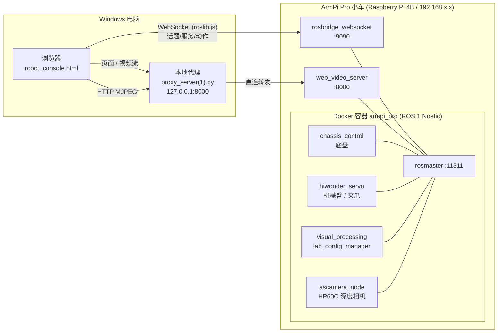

# 多车协作 · ArmPi Pro 任务控制台

> 一个跑在 Windows 浏览器里的机器人控制台，通过局域网遥控 **ArmPi Pro 麦轮小车**，
> 支持底盘全向移动、6 轴机械臂、深度相机画面、路径录制/回放与「自动送水」编排。
>
> **远期目标**：让它自主完成「抓取指定物品 → 运送到指定地点（座位 / 坐标 / 人）」的通用搬运任务。送水只是其中一个实例。

---

## 目录

- [当前状态](#当前状态)
- [硬件与软件环境](#硬件与软件环境)
- [系统架构](#系统架构)
- [快速开始](#快速开始)
- [控制台功能](#控制台功能)
- [关键话题与参数](#关键话题与参数)
- [目录结构](#目录结构)
- [已知问题](#已知问题)
- [开发路线](#开发路线)
- [排错](#排错)

---

## 当前状态

**阶段 0 已基本可用**：手动遥控 + 相机画面 + 路径录制/回放 + 自动送水编排。

| 能用的 | 还不能用的 |
|---|---|
| 底盘全向移动（麦轮） | SLAM 建图 / 自主导航（**雷达 LD06 已装好、`/scan` 10Hz 已通** ✅，建图未开始） |
| 6 轴机械臂 + 夹爪 | 视觉识别物品（阶段 3） |
| 深度相机 RGB 画面（实时 MJPEG） | 深度图在网页上显示（需转色节点） |
| **激光雷达 LD06（`/scan` 标准点云，230400，FT232RL 转 USB）** | 相机/雷达开机自启（现在是手动启动） |
| 路径录制 / 回放 | 动作组预设（节点未跑） |
| 自动送水编排 | 多车协作（目前只有 1 台车） |
| 电量/按键/IMU 状态监控 | |

---

## 硬件与软件环境

### 小车侧

| 项 | 实际配置 |
|---|---|
| 车型 | ArmPi Pro 麦轮智能小车（全向底盘 + 6 轴机械臂） |
| 主控 | **Raspberry Pi 4 Model B Rev 1.5**，aarch64 |
| 宿主系统 | Debian 12 (bookworm)，**宿主本身不装 ROS** |
| ROS | **ROS 1 Noetic**，全部跑在 Docker 容器 `armpi_pro` 里 |
| 容器 | 镜像 `ros:noetic`，`Privileged=true`，Binds `/dev:/dev`（USB 设备插上即透传） |
| 深度相机 | **安思疆 Angstrong Nuwa-HP60C**（单目结构光，USB ID `3482:6723`） |
| 激光雷达 | **乐动 LDROBOT LD06**（✅ 2026-09-11 已装车跑通；FT232RL 转 USB，`/dev/ttyUSB0` @230400；**接线：转接板 RX→雷达 DAT**，TX 悬空，CTL 悬空=全速） |
| 网络 | Wi-Fi，**IP 每次开机都可能变** |

> ⚠️ **重要**：本项目的实车是 **ROS 1 + 单目/深度相机**，不是 ROS 2 + Nav2 + RealSense。
> 子目录 `多车协作/ReadMe.md`、`开发文档.md` 是早期的设计稿（ROS 2 Humble + Nav2 + MoveIt 2 + YOLOv8），
> **与实际硬件不符，尚未改写**，仅作参考。

### 电脑侧

| 项 | 配置 |
|---|---|
| 系统 | Windows |
| Python | `C:\Users\Administrator\.workbuddy\binaries\python\envs\default\Scripts\python.exe`（带 paramiko 5.0.0） |
| 本地代理 | `proxy_server(1).py`，监听 `127.0.0.1:8000` |
| 浏览器 | 任意现代浏览器（推荐 Edge / Chrome） |

---

## 系统架构



**两条链路，各司其职：**

| 链路 | 端口 | 协议 | 用途 |
|---|---|---|---|
| rosbridge | `9090` | WebSocket | 控制指令、状态订阅（roslib.js） |
| web_video_server | `8080` | HTTP MJPEG | 相机实时画面 |

> 电脑侧为什么要多一个本地代理？
> 因为 `file://` 打开页面时取 `8080` 会**跨域被拦**，所以页面经 `127.0.0.1:8000` 加载，
> 视频请求变成同源，再由代理转发到小车。

---

## 快速开始

### 1. 电脑侧 —— 双击 `启动控制台.bat`

它会自动启动本地代理并打开浏览器到 `http://127.0.0.1:8000`。
（端口 8000 已在监听时会跳过启动，不会重复起）

手动两步的等价做法：

```bat
cd /d D:\多车协作
"C:\Users\Administrator\.workbuddy\binaries\python\envs\default\Scripts\python.exe" "proxy_server(1).py"
```

然后浏览器打开 `http://127.0.0.1:8000`。

> ⚠️ **不要双击 `robot_console.html`**。`file://` 协议下取视频会因跨域失败。

### 2. 页面侧

1. 「小车 IP」填当前地址 → 点 **「连接」**（左上角变绿点即成功）
2. 「画面源」选 **深度相机RGB /ascamera_hp60c/rgb0/image**
3. 画面若暂时是黑的，页面会**自动重试**（每 3 秒一次、最多 5 次）；也可以**点画面**强制刷新

### 3. 小车侧（小车重启过才需要）

小车 **IP 每次开机都会变**，先查：

```bat
ping raspberrypi
```

然后启动**深度相机节点**（它不在开机自启链条里，重启就丢）：

```bat
ssh pi@<小车IP> "docker exec -d -w /home/ubuntu armpi_pro bash -lc 'bash /home/ubuntu/run_ascam_hp60c.sh > /tmp/ascam_run.log 2>&1'"
```

密码 `raspberrypi`（**输入时不显示字符**是正常的）。

> 📖 **完整恢复清单（含三个"静默杀手"的规避方法）见 [`开机恢复.md`](开机恢复.md)**

---

## 控制台功能

| 卡片 | 说明 |
|---|---|
| **摄像头** | 经 `web_video_server :8080` 看实时画面；可切换画面源、截图、备用播放（iframe） |
| **底盘移动** | 麦克纳姆轮全向：前后左右 + 斜向 + 原地旋转；速度/角速度可调 |
| **机械臂关节** | 6 个关节角度滑块（弧度）+ 全部回中 + 夹爪张开/闭合/走到该位置 |
| **预设动作组** | 通过 `ActionGroupRunner` action 执行预录动作组（⚠️ 节点当前未跑，见已知问题） |
| **视觉任务** | 调用 `std_srvs/Trigger` 开关视觉功能（巡线 / 颜色识别 / 目标跟踪等） |
| **外设** | 蜂鸣器、LED、RGB 灯、摄像头开关 |
| **自动送水编排** | 录制「去程 / 回程」路径 → 一键自动送水；支持放弃本次录制 |
| **状态监控** | 电量、按键、角速度 Z、线加速度 X |
| **日志** | 所有发布/服务调用/连接事件的滚动日志 |

**路径录制 → 回放 → 自动送水** 的工作方式：

1. 点「录制」，手动遥控车走一遍**去程**，存为 `go`
2. 同样录制**回程**，存为 `back`
3. 点「自动送水」→ 车自动执行 去程 → 抓取（夹爪动作）→ 回程 → 放下
4. 路径存在浏览器 `localStorage` 里，刷新不丢

---

## 关键话题与参数

### 深度相机（安思疆 HP60C）

| 话题 | 类型 | 实测 |
|---|---|---|
| `/ascamera_hp60c/rgb0/image` | `sensor_msgs/Image` | 640×480 **bgr8**，step 1920，**~12.4 Hz** |
| `/ascamera_hp60c/depth0/image_raw` | `sensor_msgs/Image` | 640×480 **16UC1**，step 1280，**单位 mm** |
| `/ascamera_hp60c/depth0/points` | `PointCloud2` | — |
| `/ascamera_hp60c/rgb0/camera_info`、`/depth0/camera_info` | `CameraInfo` | — |

- `frame_id` = `ascamera_hp60c_color_0`
- 深度实测：有效像素 39%，量程 263 ~ 1286 mm

### 机械臂夹爪标定

```
pulse = 700 + pos × 318.3        工作窗口 525 ~ 655
GOPEN  = -0.14                   张开
GCLOSE = -0.55                   闭合
```

### 视觉处理话题

- `/visual_processing/image_result`
- `/lab_config_manager/image_result`
- `/object_tracking/image_result`、`/line_following/image_result`、`/hand_trajectory/image_result`
  （具体有哪些取决于本次开机拉起的功能节点）

---

## 目录结构

```
D:\多车协作\
├─ 启动控制台.bat            ← 一键启动（本地代理 + 浏览器）
├─ robot_console.html        ← 控制台前端（单文件，内嵌 roslib.js 1.3.0）
├─ proxy_server(1).py        ← 本地代理，转发视频流到小车 8080
├─ 开机恢复.md               ← 关机后恢复步骤 + 排错速查
├─ README.md                 ← 本文件
│
├─ 多车协作\                 ← 原厂资料 + 早期设计稿
│  ├─ ReadMe.md 开发文档.md   （⚠️ ROS 2 设计稿，与实车不符）
│  ├─ ROS1配置及使用\         ← 安思疆 HP60C 的 ROS1 SDK 资料包
│  └─ 安思疆深度相机\
│
├─ ArmPi Pro麦轮智能小车\     ← 原厂教程 / 源码 / 镜像 / 硬件资料
│
├─ Many-Robot-Work-Together\ ← GitHub 备份仓库（见下）
│
└─ .workbuddy\
   ├─ scripts\               ← 可复用工具（见下表）
   ├─ memory\                ← 项目记忆（长期事实 + 每日工作日志）
   └─ shots\                 ← 调试截图 / 抓帧
```

### GitHub 仓库结构

仓库：<https://github.com/sususu123545/Many-Robot-Work-Together>

```
Many-Robot-Work-Together/
├─ README.md                      ← 本文件
├─ armpi_pro/                     ← 车端 ROS 源码 + 原厂软件（21 个功能包）
├─ web_console/
│  ├─ robot_console.html          ← ✅ 当前在用的控制台（rosbridge 直连版）
│  ├─ proxy_server(1).py          ← ✅ 当前在用的本地代理
│  ├─ 启动控制台.bat               ← ✅ 一键启动
│  ├─ server.py                   ← ⚠️ 早期 FastAPI 版后端（未使用，留档）
│  └─ static/index.html           ← ⚠️ 早期 FastAPI 版前端（未使用，留档）
├─ car_setup/                     ← 车端部署用的定制文件
│  ├─ run_ascam_hp60c.sh          ← 容器内启动 HP60C 相机节点
│  └─ start_camera.launch         ← 已注释掉 usb_cam 的版本（防它抢占 /dev/video0）
├─ docs/
│  ├─ 开机恢复.md                  ← 关机后恢复 + 排错
│  ├─ 开发文档.md                  ← 早期设计稿（与实车不符）
│  └─ 设计稿-ROS2版.md             ← 早期 README（ROS 2 架构，与实车不符）
└─ tools/                         ← 命令行工具
   ├─ pi_run.py  pi_upload.py  pi_pull.py
   ├─ car_grab.py  net_scan.py
```

> ⚠️ `web_console/server.py` + `static/index.html` 是**早期 FastAPI 版**（带 `SimAdapter` 模拟执行器），
> 现已不维护。当前实际使用的是 `robot_console.html`（浏览器直连 rosbridge，无需后端进程）。

### `.workbuddy\scripts\` 工具

| 脚本 | 用途 |
|---|---|
| `pi_run.py` | 在车上执行命令（带超时、重试、部分输出保留） |
| `pi_upload.py` | 上传文件到车上（SFTP 优先，sha256 校验） |
| `pi_pull.py` | 从车上取文件（SFTP → base64 兜底，两端 sha256） |
| `car_grab.py` | 从相机 MJPEG 流抓一帧存本地，**自动丢弃全黑的首帧** |
| `net_scan.py` | 扫局域网找小车 |

用法示例：

```bat
python .workbuddy\scripts\car_grab.py --ip 10.120.150.178 --out shots\cam.jpg
python .workbuddy\scripts\pi_run.py --host 10.120.150.178 --cmd "ps -ef | grep ascamera"
```

---

## 已知问题

| # | 问题 | 影响 | 计划 |
|---|---|---|---|
| 1 | **相机节点不在开机自启链条里** | 每次重启/掉电都得手动 ssh 拉起 | ⭐ 最高优先，接进 `start_functions.launch` |
| 2 | 「截图」按钮得到全黑图 | `/snapshot` 每次都新建订阅 → 命中 SDK 全黑的第 0 帧 | 改成用 canvas 从流里截 |
| 3 | 深度图无法直接上网页 | `web_video_server` 编不了 `16UC1` | 需加「深度 → 伪彩 → bgr8」转色节点 |
| 4 | 动作组不可用 | `ActionGroupRunner` 的 `/goal` 无订阅者，节点未跑 | 查明启动方式并验证 4 个动作组名 |
| 5 | **供电欠压** | 高负载（编译 / 取流）时 `throttled` 跳到 `0x50005`，实测已因欠压掉电重启过一次 | 换 5V/3A 电源 + 带供电 USB Hub |
| 6 | 小车 IP 每次开机都变 | 页面 IP 要手动改 | 可考虑给路由器配静态租约 |
| 7 | `usb_cam` 曾抢占 `/dev/video0` | 导致深度相机打不开、画面花屏 | ✅ 已注释 `start_camera.launch`，已停用 |

---

## 开发路线

```
阶段 0  遥控 + 录制回放          ← 当前，基本可用
   ↓
阶段 1  加装 LD06 激光雷达 → SLAM 建图
   ↓
阶段 2  自主导航（move_base / 或 Nav2 移植）
   ↓
阶段 3  视觉识别物品与人 → 自主抓取与送达
```

**任务模型**（泛化后）：

```
{ 目标物品, 取货点, 目的地(座位 / 坐标 / 人) }
```

送水 = `{水瓶, 饮水机/桌面, 指定座位}` 的一个实例。

**传感器组合**：LD06 雷达（负责平面 SLAM/导航）+ HP60C 深度相机（负责识别/避障/抓取）。
2D 雷达只扫一个平面，盲区靠深度相机补。

---

## 排错

**最完整的排错清单在 [`开机恢复.md`](开机恢复.md)**，这里列最常遇到的：

| 现象 | 原因 | 处理 |
|---|---|---|
| 页面打不开 | 本地代理没起 | 双击 `启动控制台.bat` |
| 页面能开，但「连接」失败 | 小车 IP 变了 | `ping raspberrypi` 查新 IP |
| 连上了但没画面，角标在数重试 | 该话题没有发布者（相机节点没起） | 拉起相机节点；页面会自动重试 |
| 画面全黑 | 同上，或命中 SDK 全黑首帧 | 点画面刷新；或换画面源验证链路 |
| 「截图」是黑图 | 已知问题 #2 | 看实时画面即可 |

**ssh 命令"发了却什么都没发生"** —— 三个静默杀手（详见 `开机恢复.md`）：

1. 必须以 **root** 跑（`ubuntu` 用户不在 `video` 组 → `uvc_open:Access denied`）
2. 脚本没有可执行权限 → **必须写 `bash <脚本>`**
3. 日志重定向到 root 属主的旧文件 → 重定向在跑脚本前就失败，且 `-d` 会把错误吞掉

---

## 相关文档

| 文档 | 内容 |
|---|---|
| [`开机恢复.md`](开机恢复.md) | 关机后恢复步骤 + 排错速查表 |
| `多车协作\ReadMe.md`、`开发文档.md` | 早期 ROS 2 设计稿（**与实车不符，待改写**） |
| `多车协作\ROS1配置及使用\` | 安思疆 HP60C 的 ROS1 SDK 官方资料 |
| `ArmPi Pro麦轮智能小车\` | 原厂教程 / 源码 / 系统镜像 / 硬件资料 |
| `Many-Robot-Work-Together\` | GitHub 备份仓库 |
