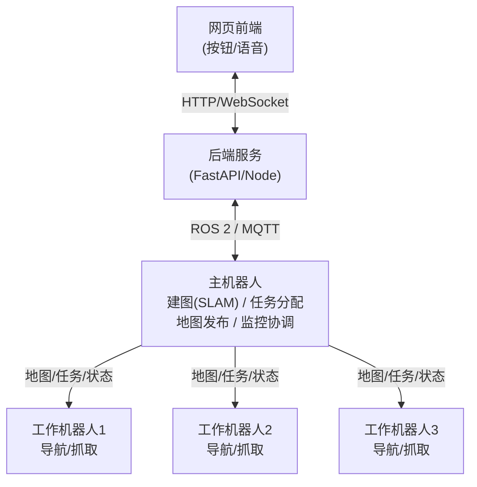
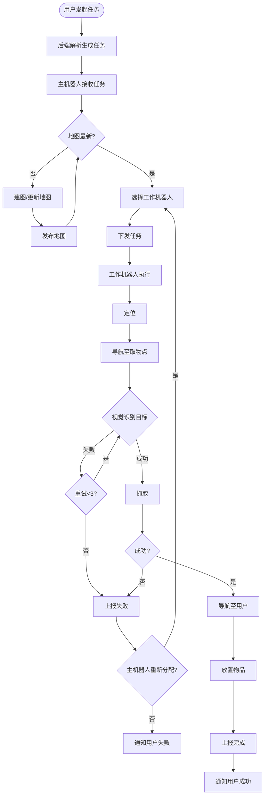
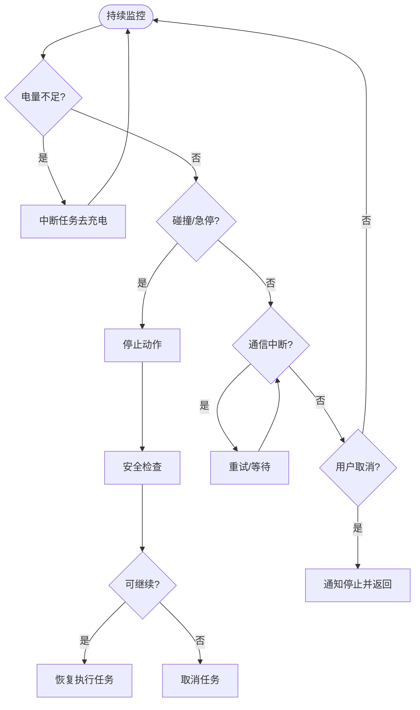

以下是一份完整的 Markdown 格式文档，可直接复制保存为 `README.md` 文件。

# 多机器人协作服务系统

## 项目简介

本项目实现了一个**主从式多机器人协作系统**，用于在室内环境中完成用户通过网页下达的服务任务（如“给我拿一杯水”）。系统由一个主机器人负责环境建图、任务调度与监控，多个工作机器人负责执行具体的导航、抓取和配送任务。用户可通过网页前端提交指令，并实时查看任务进度。

## 系统架构



## 功能特性

- **网页指令下达**：用户可通过网页按钮或文本输入发起任务（如“拿一杯水”）。
- **主机器人建图与调度**：主机器人使用SLAM构建环境地图，并将地图分发给工作机器人；同时根据机器人状态进行任务分配。
- **多机器人协作**：多个工作机器人可并行执行任务，主机器人协调路径避免冲突。
- **视觉抓取**：工作机器人通过深度相机和YOLO识别目标物体，并使用机械臂完成抓取。
- **异常处理与安全**：具备电量监测、碰撞检测、通信中断恢复、任务取消等安全机制。
- **实时状态反馈**：网页端实时显示机器人位置、任务状态和进度。

## 工作流程

### 总体流程

1. **任务发起**：用户在网页点击或输入指令。
2. **后端解析**：后端将指令转换为结构化任务（物品、目标位置等）。
3. **主机器人决策**：检查地图、选择工作机器人、下发任务（包含地图、导航点、抓取参数）。
4. **工作机器人执行**：定位、导航至取物点、视觉识别抓取、导航至送达点、放置物品。
5. **状态反馈**：工作机器人实时上报状态，主机器人更新至网页，用户可查看进度。

详细流程见下图（Mermaid 流程图，可在支持 Mermaid 的编辑器中查看）：

**主任务流程：**



**异常与安全监控流程：**



### 异常处理

- **电量不足**：工作机器人自动中断任务，导航至充电桩充电，主机器人重新分配任务。
- **碰撞/急停**：立即停止所有动作，等待人工检查或自动恢复；若不能继续则取消任务。
- **通信中断**：主从之间心跳检测，自动重试；超时则触发保护机制。
- **用户取消**：网页端可随时取消任务，主机器人通知工作机器人安全返回。
- **抓取失败**：视觉识别或抓取失败重试3次，仍失败则上报，由主机器人决定是否换机器人或终止任务。

## 技术栈

- **机器人操作系统**：ROS 2 Humble
- **建图与定位**：SLAM Toolbox（2D）、Cartographer（可选）、AMCL
- **导航**：Nav2
- **视觉识别**：YOLOv8 + OpenCV + Intel RealSense深度相机
- **机械臂控制**：MoveIt 2 + ROS 2 Control
- **网页通信**：rosbridge_suite + roslibjs，后端FastAPI/Node.js
- **任务分配**：自定义调度节点（Python/C++）
- **通信中间件**：ROS 2 Topic/Service/Action，MQTT可选

## 安装与运行

### 环境要求

- Ubuntu 22.04
- ROS 2 Humble
- Python 3.10+
- 依赖库：`numpy`, `opencv-python`, `fastapi`, `uvicorn`, `rosbridge_suite` 等

### 安装步骤

1. 安装ROS 2 Humble（参考[官方文档](https://docs.ros.org/en/humble/Installation.html)）
2. 创建工作空间并克隆本项目：
   ```bash
   mkdir -p ~/robot_ws/src
   cd ~/robot_ws/src
   git clone https://github.com/your-repo/multi-robot-service.git
   ```
3. 安装依赖：
   ```bash
   cd ~/robot_ws
   rosdep install --from-paths src --ignore-src -r -y
   pip install -r src/multi-robot-service/requirements.txt
   ```
4. 编译：
   ```bash
   colcon build --symlink-install
   source install/setup.bash
   ```

### 运行系统

1. **启动主机器人**（建图+调度）：
   ```bash
   ros2 launch master_robot master_bringup.launch.py
   ```
2. **启动工作机器人**（可启动多个，需修改命名空间）：
   ```bash
   ros2 launch worker_robot worker_bringup.launch.py robot_name:=worker1
   ```
3. **启动后端服务**：
   ```bash
   ros2 run web_backend backend_node
   ```
4. **启动网页前端**：
   ```bash
   cd web_frontend
   npm install
   npm start
   ```
5. 打开浏览器访问 `http://localhost:3000`，即可通过网页下达任务。

## 使用说明

- 在网页界面点击预设任务按钮（如“拿一杯水”）或输入自然语言指令。
- 系统会自动解析并分配任务，用户可在页面查看机器人实时位置和任务状态。
- 可随时点击“取消任务”按钮终止当前任务。
- 紧急情况下可按下页面上的“急停”按钮，所有机器人立即停止。

## 未来改进方向

- **自然语言理解**：集成大语言模型，支持更复杂的指令解析。
- **多用户权限管理**：支持多用户并发操作，设置不同权限级别。
- **云端调度**：将调度和地图存储迁移至云端，支持多地点远程部署。
- **强化学习优化**：使用强化学习优化任务分配和路径规划，提高效率。
- **动态环境适应**：增强地图更新和物体位置跟踪能力，适应变化的环境。

## 许可证

本项目采用 MIT 许可证，详见 [LICENSE](LICENSE) 文件。

## 联系方式

如有问题或建议，请联系：463613510@qq.com

